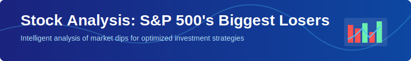
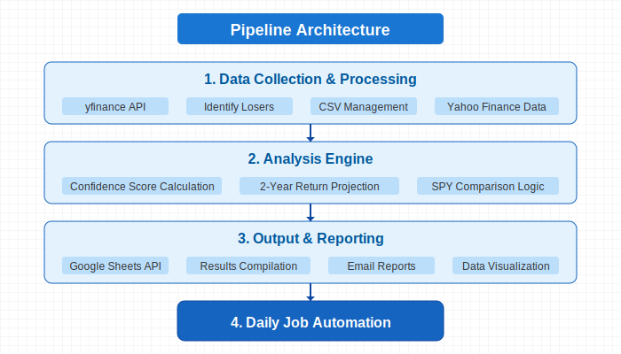
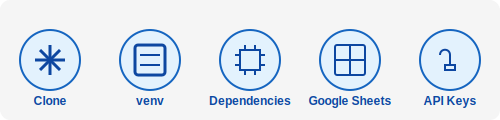

## Introduction

This repository is designed to:

- Run a daily job that offers recommendations about buying the S&P 500s stocks with the largest daily losses by percentage. 

- Distribute that recommendation and a brief analysis of the calculation to an email list.

The stock model answers a burning question many of us have had, what would happen if I simply bought the biggest loser in the stock market every day and held it? It's such a simple way to think about "buying the dip", but let's see what the data has to say. Since there are genuine risk concerns with buying some of the more obscure stocks on the market, we've isolated the analysis to just look at the S&P 500. 

This document will go through the methodology and corresponding code for the model that runs this daily job and makes the recommendations.


## Results/Takeaways


As you can see from the above table, buying the 5 largest daily losers without any sort of additional methodology(see the rows where confidence score is 0) does in fact yield a higher average return than buying the S&P 500 as a whole. However, applying our model and a confidence value level greatly improves the results - more than doubling the return gain over SPY. There is another added benefit to using the confidence levels we put together, it greatly simplifies the strategy to make it practical for a normal investor. Instead of buying 5 stocks each trading day, the average you would buy with a confidence score of 65 is just 1.9-2.3 stocks a week. Further raising the confidence level continues to reduce that amount, but does introduce some obvious concerns as there are only a few stocks in our methodology even capable of fitting into that criteria(based on things like their industry and volume). Therefore, the recommendation at this time is a confidence score of 65 be utilized and this will be the value used for the daily(trading days only) email report arising from this model. 

- One unexpected learning was that not that many of the S&P 500 stocks ever find themselves in the bottom 5 losers list. For the 15 year period from 1998-2023, only 92 of the 500 stocks showed up there.
- There are many ways to continue to improve this model further and there will be continued development on it to optimize the weights especially. 


## Methodology

- The period from January 1st, 2014 to January 1st, 2019 was used to run the initial analysis which helped identify the key factors and weights to apply to them. This was chosen because it avoided any noisy data from COVID-19. It should be noted that all relevant data concerning COVID is still included in the results section since the model is run up until the the end of 2023(to allow for 2 year returns to have come to fruition).

- The 2014-2019 data was exported to a Google sheet where trends were observed among the most successful returns for purchases made on those stocks. Some basic criteria emerged and were experimented on as factors to determine what makes a better 'buy'.

- The current weights are:
    - industry(Is it a technology or healthcare company?): 15%
    - dividends(Is the dividend yield less than 1%): 15%
    - reit(Is it not an REIT): 10%
    - severity_of_loss(Did the stock lose more than 5%): 30%
    - ranking(Favoring the biggest loser more than the 5th biggest): 10%
    - volume(Is the stock volume greater than 30000000): 20

- For the SPY comparisons in a given period, the assumption is that SPY was purchased every single day during the period and then sold as many years later as the comparative stock(s) that would have been bought that day(either 2 years or 5 years later in most cases).

- 2 and 5 year periods were used because they are common time frames for investors to expect return on their money and avoid any concern of short term capital gains. 

- Winning percentage simply means the percentage of stock purchases in that period that wound up making any amount of money. 

- TSLA was the only current S&P 500 company removed entirely from the analysis and recommendations because over some periods analyzed it appeared far too frequently on the biggest losers list and significantly skewed data. 


## Project Architecture





**Data Acquisition:** Scripts use yfinance (and in some cases yahooquery) to fetch stock data for a given date range.

**Identification of Biggest Losers:** Logic in analysis.py and dailyjobHelperMain.py determines which stocks had the largest daily losses.

**Confidence Scoring:**
dailyjobHelperMain.py (uses a hardcoded set of weights and Yahoo Finance data).


**2-Year Return Calculation:** Calculating a forward 2-year return for each of these biggest losing stocks.
Reporting & Analysis:
Summaries (winning percentage, average returns, day-of-week trends, etc.).
SPY 2-year rolling return for comparison.
Data optionally uploaded to Google Sheets via gsheets_helper.py.
CSV Management: csvCleaner.py can sanitize and clean CSV files of tickers or any other list-based CSV.

### File Overview
1. **analysis.py**

    Core file for:

    get_biggest_losers(data, date): Finds top 5 daily losers for a specified date using Open-High-Low-Close data in a data dictionary.
        
    calculate_return(data, symbol, start_date, pc): Calculates the 2-year return (future performance) of a stock starting from start_date.

    analyze_results(df_results, sd, ed): Produces aggregated results (winning percentage, average return, day-of-week trends, and SPY rolling 2-year comparison).

    Key Points:

    Uses yfinance for stock data (passed in from another script).

    The function analyze_results also tries to fetch SPY data for a quick 2-year rolling calculation.

2. **csvCleaner.py**

    A utility script to clean a CSV file by removing:

    All numbers, Dashes, Double quotes

It also ensures there are no duplicate values across the entire file.

    python csvCleaner.py

Will:

Read AllTickers.csv (hard-coded) by default.

Produce cleaned_output.csv with sanitized data.

Key Points:

    Useful if you have a messy ticker list or other CSV data you want to standardize.

3. **currentSANDP.csv**

A comma-separated file of S&P 500 tickers.

This file is used by main.py and dailyjob.py to load a list of tickers when retrieving data.

If you need to update the S&P 500 listing, simply update this file or point the code to a new file.

4. **dailyjob.py**

Script similar in spirit to main.py but designed to run on a daily basis:

Imports logic from dailyjobHelperMain.py instead of analysis.py.

Fetches data for a smaller, more recent range (e.g., last 3 days) — you can modify the start_date and end_date logic at the top.

Identifies the biggest losers for each day, but the code that calculates 2-year returns and uploads to Sheets is currently commented out or replaced (so you can customize it).

Key Points:

    Typically run via cron job or scheduled to gather daily losers and store them in a database, another CSV, or Google Sheets.

5. **dailyjobHelperAI.py**

Contains:

    get_biggest_losers(data, date): Similar to analysis.py but includes calls to OpenAI to compute a pydantic-based confidence score for each biggest loser.

    calculate_return(...) and analyze_results(...): Same 2-year return logic and analysis as analysis.py, but used in synergy with AI-based confidence scoring.

    Uses an OpenAI GPT call with a custom prompt that calculates a confidence score (0–100) from weighted criteria.

Key Points:

    Requires an openai.api_key to be set. The script references it at the top.

    Contains a demonstration of using pydantic models (TicketResolution) to parse GPT responses.

6. **dailyjobHelperMain.py**

    Provides an alternative (non-AI) approach to calculate confidence scores:

    Uses yahooquery.Ticker to fetch fundamental data (e.g., dividend yield, industry).

    Defines a calculate_confidence_score(...) function that sums weights for:

        *Industry* 
        *Growth vs. Blue Chip*
        *Dividend yield*
        *REIT*
        *Severity of loss*
        *Ranking*

Key Points:

    The get_biggest_losers(data, date) function sorts daily % changes, picks the top 5 losers, and logs their computed scores.

    This file parallels dailyjobHelperAI.py but uses a local, rules-based logic instead of OpenAI.

7. **finaltickers.csv**

Another comma-separated file of tickers.

Provided as an additional resource (e.g., final set or alternate ticker list).

Not necessarily used directly by the main scripts unless you decide to reference it.

8. **gsheets_helper.py**

Handles Google Sheets interactions:

upload_df_to_sheets(df, sheet_name, creds_file, worksheet_name='Export_sheet'):
    - Converts a pandas DataFrame into a list of lists.
    - Clears the target worksheet.
    - Updates the sheet's cells.

Key Points:

    Requires a valid Google service account JSON credentials file (passed as creds_file).

    Uses gspread and oauth2client.service_account for authentication.

9. **main.py**

The primary script for large-scale or historical analysis.

    1. Defines a 5-year window ending 6 years back from now (thus ensuring a 2-year forward gap).
    2. Reads S&P 500 symbols from currentSANDP.csv.
    3. Uses analysis.py methods:
        - get_biggest_losers(...) daily.
        -calculate_return(...) to see if these losers recovered over 2 years.
        - Collects results into a DataFrame.
        - Passes results to analyze_results(...).
    4. Uploads the final DataFrame to Google Sheets using upload_df_to_sheets(...)

Key Points:

    - The timeframe logic (rolling 5-year window, offset by 2 years) is adjustable as needed.
    - By default, it attempts to fetch SPY for comparative analysis.
    - Produces daily biggest loser data across the entire date range.


## Setup & Installation



1. **Clone the Repository**

    ```bash
    git clone https://github.com/your-username/StockAnalysisBiggestLosers.git
    cd StockAnalysisBiggestLosers
    ```

2. **Create a Virtual Environment (optional but recommended)**

    ```bash
    python -m venv venv
    source venv/bin/activate  # On macOS/Linux
    ```

    # or

    ```bash
    venv\Scripts\activate  # On Windows
    ```

3. **Install Required Python Dependencies**

    ```bash
    pip install -r requirements.txt
    ```

    (If a requirements.txt doesn't exist yet, you can generate one by listing: pandas, yfinance, tqdm, pytz, openai, pydantic, gspread, oauth2client, yahooquery.)

4. **Set Up Google Service Account Credentials (for Sheets upload):**

    - Create or obtain a service account JSON file from Google Cloud.
    - Place it in a secure location, and note its path.
    - Update paths in main.py or dailyjob.py where you see references to creds_file.

5. **(Optional) Set OpenAI Key (for scripts using GPT):**

    Export an environment variable:

    ```bash
    export OPENAI_API_KEY="sk-..."
    ```
    or place your key in the code (not recommended for production).


## Usage

### Running main.py
1. Edit date ranges in main.py if needed.
2. Ensure currentSANDP.csv is up to date.
3. Run:

    ```bash
    python main.py
    ```

4. Once completed, it will:
    - Fetch the historical stock data for each symbol.
    - Identify the biggest losers each day in that range.
    - Calculate 2-year forward returns.
    - Print overall trends, day-of-week analysis, and SPY comparisons.
    - Upload the compiled DataFrame to your specified Google Sheet (if credentials are set).

### Running dailyjob.py
If you want a short-range, daily process:

1. Check dailyjob.py's start_date and end_date logic.

2. Confirm or edit the references to dailyjobHelperMain.py or dailyjobHelperAI.py.

3. Run:

    ```bash
    python dailyjob.py
    ```

4. The script can be scheduled (using cron, Task Scheduler, etc.) to execute daily.

### Other Utilities
- csvCleaner.py:

    - Cleans AllTickers.csv → cleaned_output.csv.

- dailyjobHelperAI.py vs. dailyjobHelperMain.py:

    - Swap the import in dailyjob.py to decide which "helper" approach you prefer (AI-based vs. rules-based scoring).
